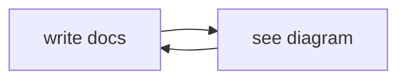
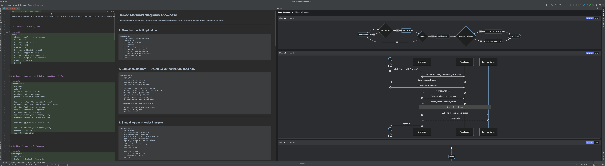
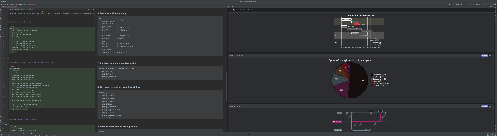
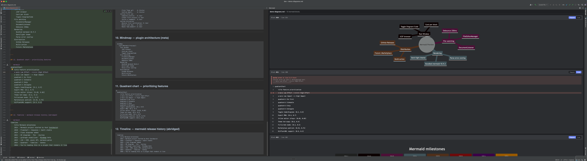
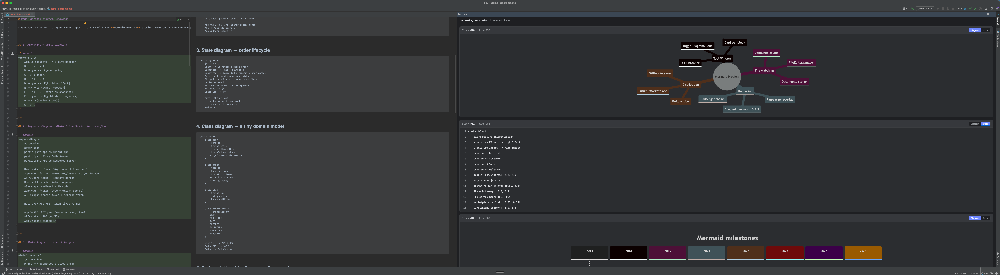

# Mermaid Preview

> JetBrains IDE plugin that renders **Mermaid diagrams inside Markdown files** in a side panel, with a per-block toggle to flip between source and the rendered diagram — instantly.

Open any `.md` file that contains a fenced `mermaid` block:

<pre>

</pre>

…and the plugin shows the rendered diagram on the right side of the IDE. Click **Code** to see the mermaid source, **Diagram** to see the SVG. Live-refreshes as you type.


[](https://github.com/slothlabsorg/mermaid-preview-plugin/actions/workflows/build.yml)

Part of the **SlothLabs** family: CloudOrbit · DataOrbit · BastionOrbit · ProxyOrbit · WattsOrbit · **Mermaid Preview**.

---

## What it does

- Detects every <code>```mermaid … ```</code> fenced block in the `.md` / `.markdown` / `.mdx` file you have open.
- Renders each block as a card in a side tool window with a header (`Block #N · line X`).
- Per-block segmented toggle: **Diagram ↔ Code**.
- Per-block actions: **Download SVG · Download PNG · Copy source**.
- **Actionable error overlay** — parse errors show the mermaid message and highlight the offending line in the source, instead of the generic "💣 Syntax error in text".
- Live-refreshes on file switch and as you edit (250ms debounce).
- Follows the IDE's dark/light theme.
- **No network.** Mermaid 10.9.3 is bundled inside the plugin — works offline, air-gapped, everywhere.

## Screenshots

Flowcharts · sequence diagrams · state diagrams, all live-rendered:



Gantt · pie · git graph — one panel, one tool window:



Actionable errors — parse failures highlight the offending line and show mermaid's own message, no generic bomb icon:



Mindmap plus the error overlay in context:



See [docs/demo-diagrams.md](docs/demo-diagrams.md) for 12 example diagrams covering every supported Mermaid type. Open it with the plugin installed to reproduce these screenshots.

## Install

### From GitHub Releases (recommended)

1. Grab the latest `mermaid-preview-X.Y.Z.zip` from [Releases](https://github.com/slothlabsorg/mermaid-preview-plugin/releases).
2. In your JetBrains IDE: `Settings → Plugins → ⚙ → Install Plugin from Disk…`
3. Pick the downloaded zip, restart the IDE.
4. Open any `.md` with mermaid blocks → click the **Mermaid** icon on the right sidebar.

### Build from source

```bash
git clone https://github.com/slothlabsorg/mermaid-preview-plugin.git
cd mermaid-preview-plugin
./gradlew buildPlugin     # -> build/distributions/mermaid-preview-<ver>.zip
./gradlew runIde          # launches a sandbox IDE with the plugin loaded
```

Requires: JDK 17, ~2GB RAM for the Gradle build, a JetBrains IDE 2023.3 or newer running a JBR with JCEF.

## Supported IDEs

Any IDE on the IntelliJ Platform 2023.3+ with JCEF:

- IntelliJ IDEA (Community & Ultimate)
- PyCharm, WebStorm, GoLand, RubyMine, CLion, Rider, PhpStorm, DataGrip
- Android Studio

JCEF must be enabled (it is, by default, in the bundled JetBrains Runtime). If disabled, the plugin shows a clear "enable JCEF" message.

## How it works

```
┌────────────────────────────────────────────────────────────────┐
│ IntelliJ IDE process                                           │
│                                                                │
│  MermaidToolWindowFactory  ── plugin.xml entry                 │
│    └─ MermaidPreviewPanel(project)                             │
│                                                                │
│  MermaidPreviewPanel (JPanel)                                  │
│    ├─ JBCefBrowser (embedded Chromium)                         │
│    │    └─ loads file://…/slothlabs-mermaid-preview/           │
│    │              preview.html + mermaid.min.js                │
│    ├─ FileEditorManagerListener → active .md file changed      │
│    └─ DocumentListener (debounced 250ms) → live edit refresh   │
│                                                                │
│  MermaidResourceManager (APP-level Service)                    │
│    └─ extracts bundled JS/HTML into a temp dir on first use    │
│                                                                │
│  MermaidBlockExtractor (pure Kotlin)                           │
│    └─ regex scan for  ```mermaid … ```  fenced blocks          │
└────────────────────────────────────────────────────────────────┘
```

Kotlin side pushes JSON `{status, fileName, blocks[]}` to the webview via `cefBrowser.executeJavaScript("window.setPayload(...)")`. The webview handles cards + toggle locally — no round-trip to Kotlin on user interaction.

## Contributing

See [CONTRIBUTING.md](./CONTRIBUTING.md) for dev setup, architecture, roadmap, and how to pick up work.

## License

MIT. See [LICENSE](./LICENSE).

---

Made by [SlothLabs](https://github.com/slothlabsorg) · `friends@slothlabs.org`
