# Demo: Mermaid diagrams showcase

A grab-bag of Mermaid diagram types. Open this file with the **Mermaid Preview** plugin installed to see every supported diagram kind rendered side-by-side.

> **Heads up:** section **§11 (Quadrant chart)** contains an **intentional syntax error** (the `x-axis` arrow is malformed) to showcase the plugin's error-overlay feature. The plugin highlights the offending line and shows the mermaid parser message. Fix the arrow to see it render.

---

## 1. Flowchart — build pipeline

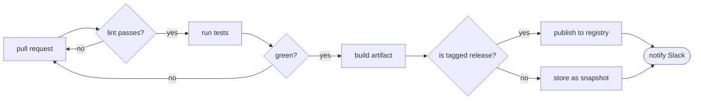

---

## 2. Sequence diagram — OAuth 2.0 authorization code flow

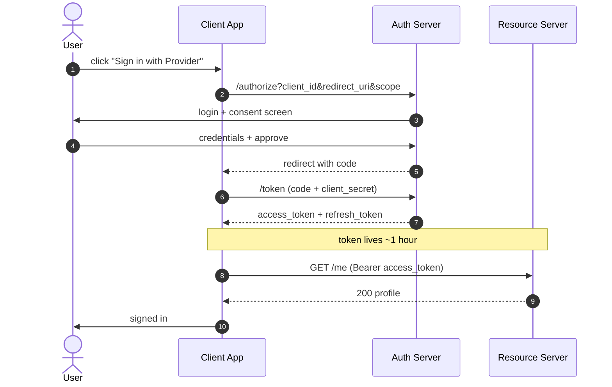

---

## 3. State diagram — order lifecycle

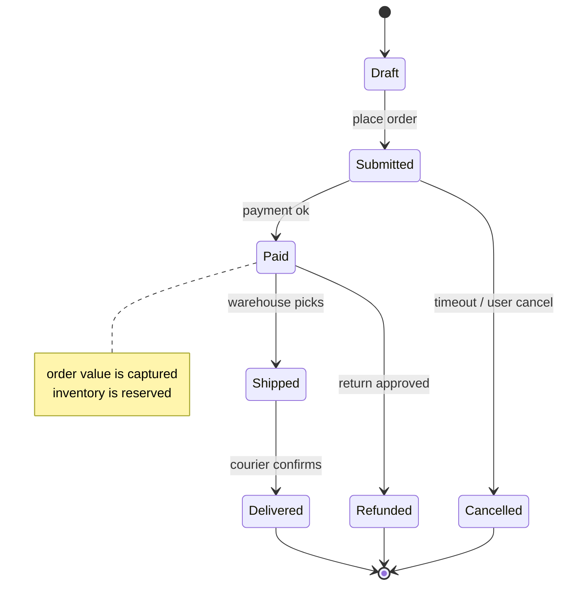

---

## 4. Class diagram — a tiny domain model

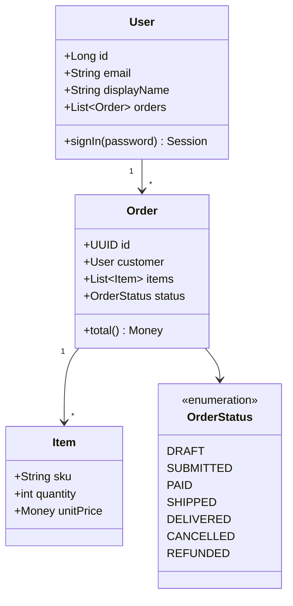

---

## 5. Entity-relationship diagram — library schema

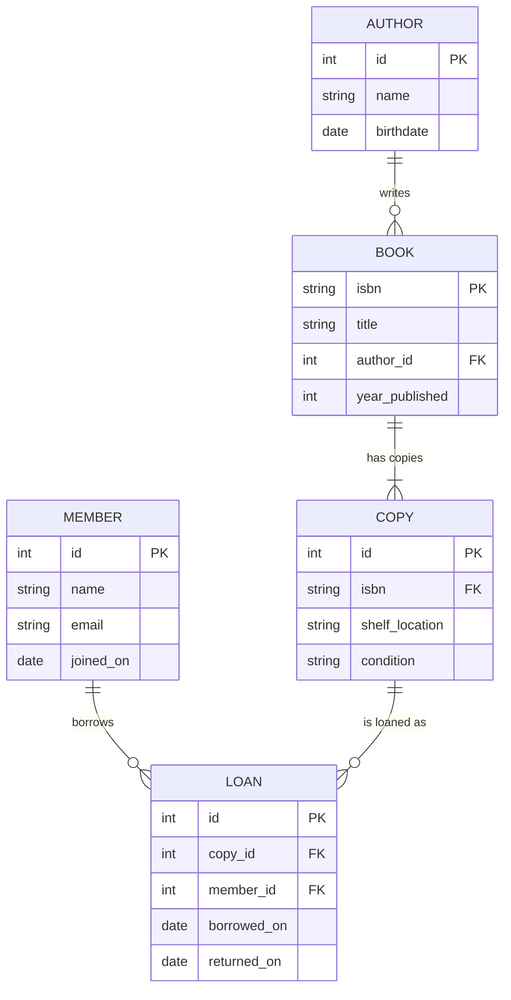

---

## 6. Gantt — sprint planning

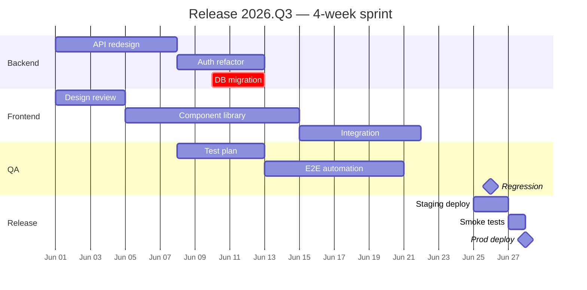

---

## 7. Pie chart — time spent last sprint

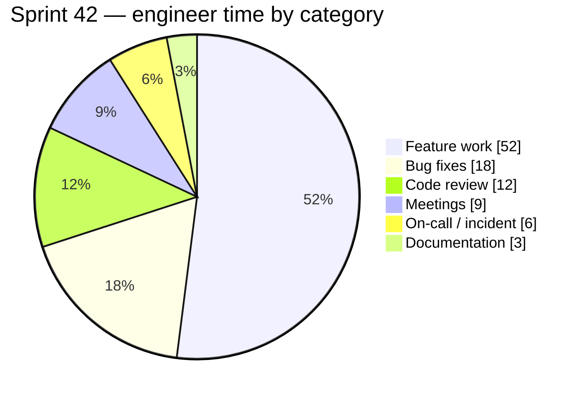

---

## 8. Git graph — feature branch workflow

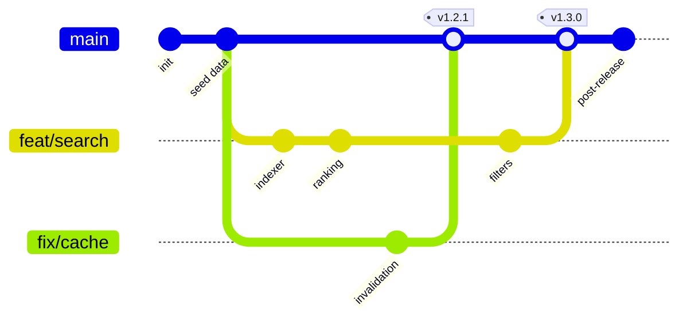

---

## 9. User journey — onboarding funnel

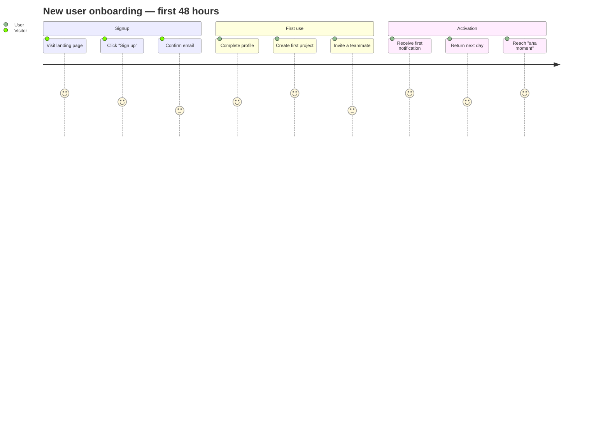

---

## 10. Mindmap — plugin architecture (meta)

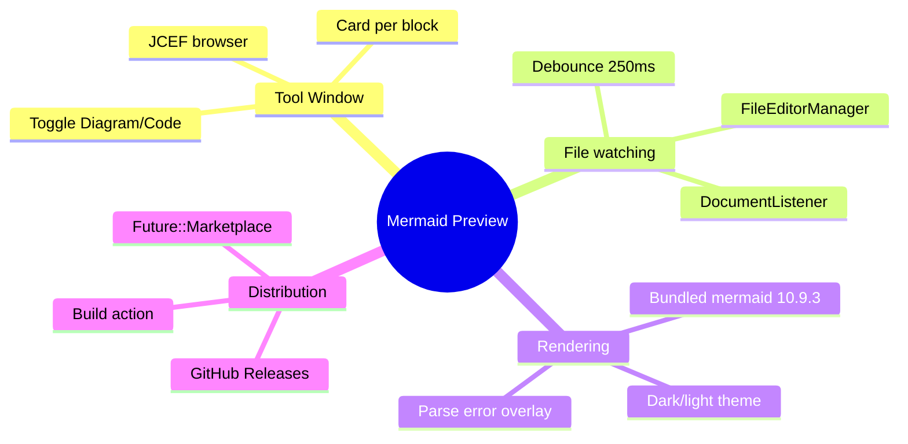

---

## 11. Quadrant chart — prioritizing features

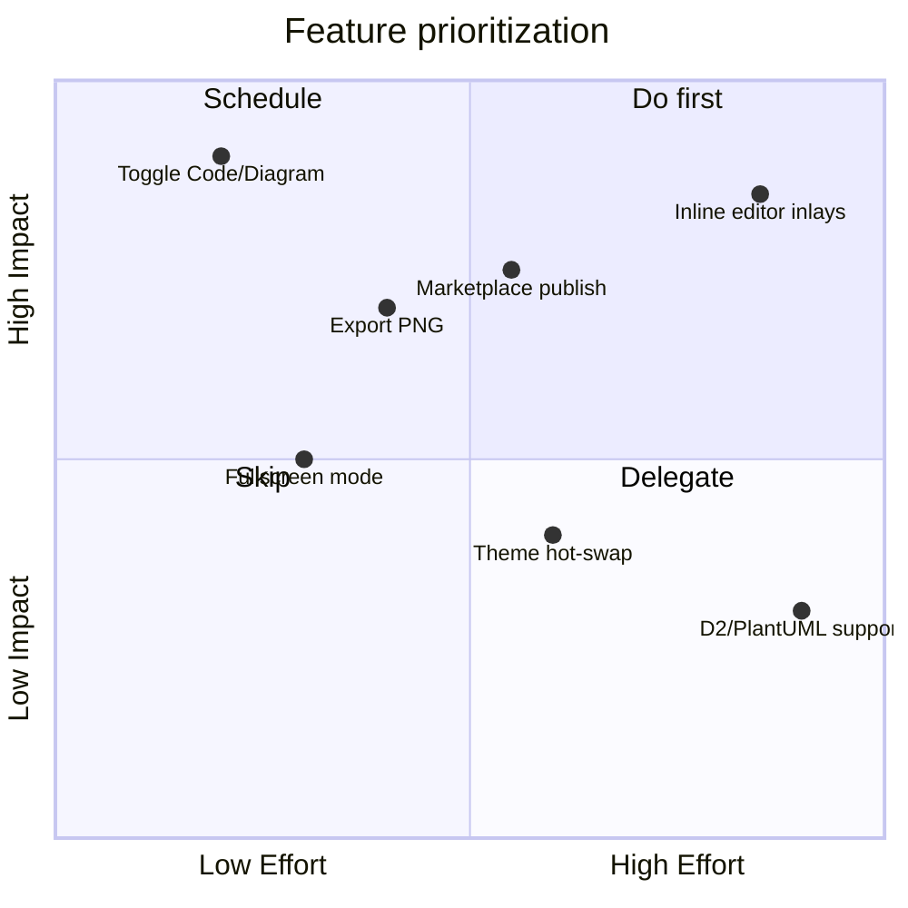

---

## 12. Timeline — mermaid release history (abridged)

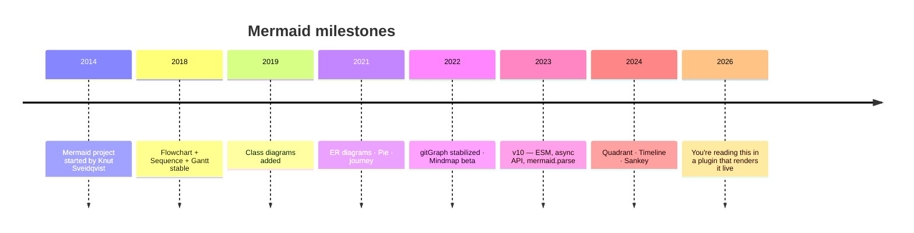
